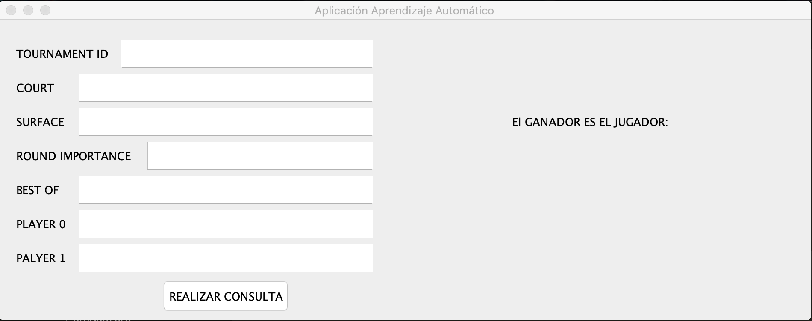

# Práctica 3 Aprendizaje Automático

## Introducción
Aplicación Java para el análisis y predicción de resultados de partidos en la ATP (Asociación de Tenistas Profesionales).

## Datos
**Tournament Id**: número de 7 dígitos que se encuentran conformados por el año y el id del torneo

**Court**: espacio en el que se juega el partido. 2 posibles opciones (Outdoor, Indoor)

**Surface**: tipo de superficie de la pista. 4 posibles opciones (Carpet, Clay, Grass, Hard)

**Round Imp**: importancia de la ronda del partido. El 1 equivale al partido de mayor importacia (Final) y el 7 equivale al partido de menor importancia (4º ronda)

**Best Of**: número máximo de sets del partido

**Player 0**: posición en el ranking del jugador 1

**Player 1**: posición en el ranking del jugador 1

**Winner**: número del jugador ganador

| Tournament Id   | Court         | Surface  | Round Imp | Best Of | Player 0 | Player 1 | Winner |
|:---------------:|:-------------:|:--------:| ---------:|--------:| --------:| --------:| ------:|
| 2000001         | Outdoor 	    | Hard     | 7         | 3       | 63       | 77       | 0      |
| 2000001         | Outdoor       | Hard     | 2         | 3       | 5        | 15       | 0      |
| 2000064   	    | Indoor        | Carpet   | 3         | 3       | 7        | 74       | 0      |
| 2015023   	    | Outdoor       | Clay     | 6         | 3       | 37       | 19       | 1      |
| 2015040   	    | Outdoor       | Grass    | 3         | 3       | 116      | 156      | 1      |
| 2016046   	    | Outdoor       | Hard     | 5         | 3       | 37       | 29       | 1      |

## Ejemplo de compilación y ejeccución de la aplicación
```
make jar
java -jar aprendizaje.jar
```


## Selección Algoritmos
### Random Forest

### Random Tree 

### REP Tree

### M5P

### Decision Stump
